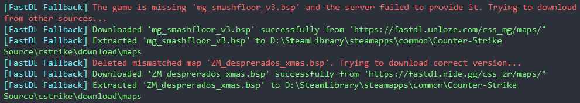

# [EN]
***[ANY] FastDL Fallback***:
- If you encounter **"Missing map maps/map.bsp, disconnecting"**, the module will attempt to download the required map from available FastDL services.
- If you encounter **"Your map maps/map.bsp differs from the server's"**, the module will delete that map and attempt to download the correct version from available FastDL services.

# Installation:
- Place the module inside the "modules" folder.
- Create a folder named FastDL_Fallback inside "modules", and put the services.txt file inside it.
- Run the core executable.
- When you encounter map-related errors, the module will automatically attempt to fix/download the required map.
- Keep an eye on the executable console and wait until it finishes processing the map.  
- Once it reports that the map has been downloaded and successfully extracted into your game folder, you can try connecting to the server again.
- You can add your own FastDL services link to the services.txt when needed.

**Credits:**
- [Unloze](https://unloze.com) – for letting us to use their FastDL.
- [Nide](https://nide.gg) – for letting us to use their FastDL.
- And many more.

# [RU]
***[ANY] FastDL Fallback***:
- Если появляется сообщение **"Missing map maps/map.bsp, disconnecting"**, модуль попытается скачать нужную карту с доступных сервисов FastDL.
- Если появляется сообщение **"Your map maps/map.bsp differs from the server's"**, модуль удалит эту карту и попытается скачать корректную версию с доступных сервисов FastDL.

# Установка:
- Поместите модуль в папку "modules".
- Создайте папку FastDL_Fallback внутри "modules" и поместите в неё файл services.txt.
- Запустите основной исполняемый файл.
- При возникновении ошибок, связанных с картами, модуль автоматически попытается исправить проблему и скачать нужную карту.
- Следите за консолью исполняемого файла и дождитесь окончания обработки карты.
- После того как появится сообщение, что карта скачана и успешно распакована в вашу игровую папку, вы можете повторно попытаться подключиться к серверу.
- При необходимости вы можете добавлять свои ссылки FastDL-сервисов в файл services.txt.

**Благодарности:**
- [Unloze](https://unloze.com) – за предоставление доступа к их FastDL.
- [Nide](https://nide.gg) – за предоставление доступа к их FastDL.
- И многие другие.
