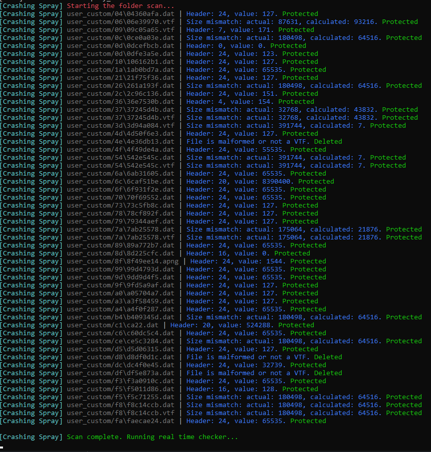

# [EN]
***[ANY] Spray crash prevention***:
- Detects and removes crashing sprays uploaded by other players, preventing those sprays from crashing your client. (Note: a new exploit was discovered by the project author that servers cannot protect against — this feature protects the local client.)

**Installation:**
- Place the module inside the modules folder.
- Run the core executable and wait for it to finish checking every spray file.
- Once it finishes, the module will monitor new files and process them immediately.

# [RU]
***[ANY] Spray crash prevention***:
- Обнаруживает и удаляет краш-спреи, загруженные другими игроками, предотвращая краш вашего клиента. (Примечание: автор проекта обнаружил новый эксплойт, против которого серверы не могут защитить — эта функция защищает только локальный клиент.)

**Установка:**
- Поместите модуль в папку modules.
- Запустите основной исполняемый файл и дождитесь завершения проверки всех файлов спреев.
- После завершения модуль будет отслеживать новые файлы и обрабатывать их немедленно.
